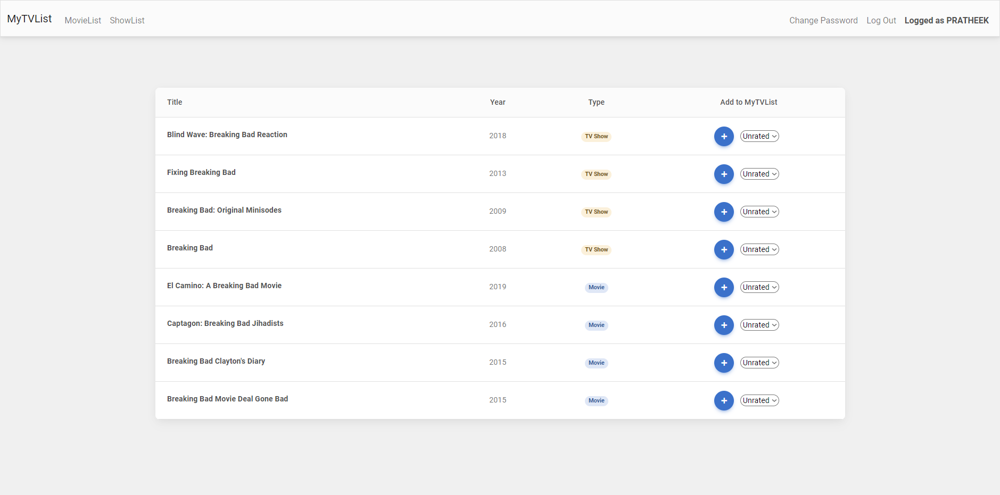
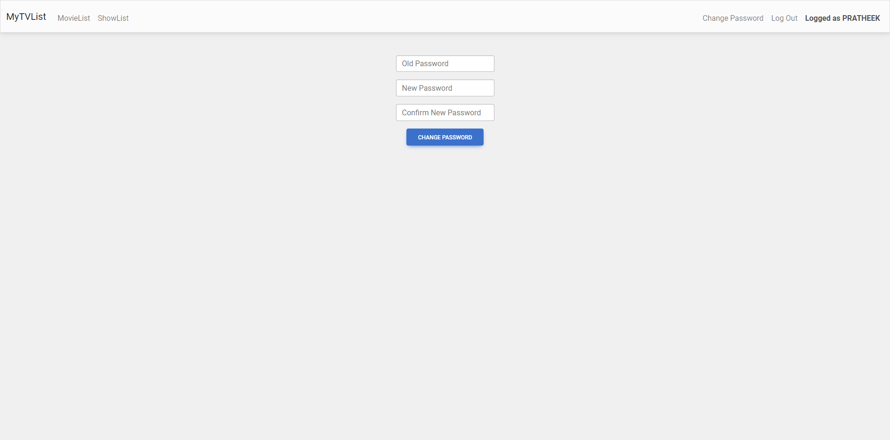

# MyTVList: A CS50 Final Project
## **Website Link**:  [https://mytvlist.onrender.com)
## **Video Demo**:  [Youtube Link](https://youtu.be/CvQf522HjuY)
---
## **Description** 
### MyTVList is my final project for the course [CS50x 2022](https://cs50.harvard.edu/x/2022/) by [Harvard University](https://www.harvard.edu). MyTVList is a Flask web application that keeps track of all the movies and TV shows you have watched and lets you give them your personal rating. 
---
## **How to access the website**
### Run the following command in the bash terminal:
```
$ flask run
```
---
## **Requirements**
- ### Python3
- ### Flask
- ### Flask Session
- ### cs50
---
## **About the files**
- ### In the project folder, you will find a python file called *app.py* in which you will find the code for all the backend processes. I used flask framework to manage the backend. 
- ### In the project folder, you will find three db files named movies.db, shows.db, users.db which contains the info of all movies from imdb, all shows from imdb, and userdata respectively.
- ### In the templates folder, you will find several html files for various pages of the web application.
- ### In the static folder, you will find a css file and a js file which i used from a CSS framework called MD Bootstrap.
- ### In the screenshots folder, you will find screenshots of various pages of the website.
- ### You will also find a requirements.txt file which is a convention for building flask applications.
---
## **How to use the website**
- ### Login/Register:
  #### You can login or register to the website through the login and register pages which should look like this:
  
  #### Make sure you password has atleast 8 characters.
- ### Home Page:
  #### After you login/register, you should see a search box like the one given below in which you can search the movie/tv show of your liking.
  
- ### Search result page:
  #### After you search for any title, you should be able to see the results in a page like this:
  
  #### Now, you can rate the title by using the dropdown and add it to your list by clicking the add button.
- ### Shows/Movies Page:
  #### You can view you added titles in ShowsList/MoviesList tabs like this:
  
  #### You can remove any title by simply clicking on the remove icon in the remove column.
- ### Change password page:
  #### Additionally, you can also change your account password by going to the change password tab.
  
- ### If you want to change the rating of any existing titles, remove them first and add them again with your desired rating.
--- 
